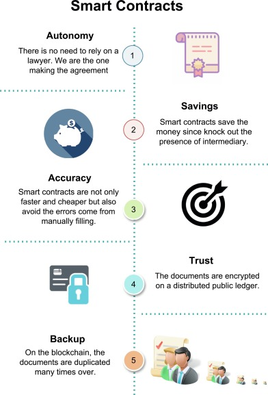
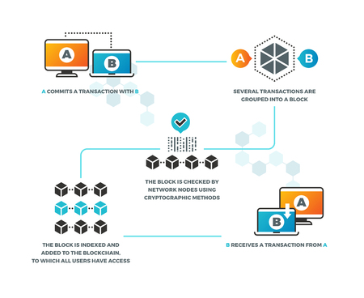

<h1 align="center">Smart Contracts Design and Implementation</h1>
<div>
<a href="https://github.com/isaaclucky/smart-contract/network/members"></a>
<a href="https://github.com/isaaclucky/smart-contract/pulls"></a>
<a href="https://github.com/isaaclucky/smart-contract/issues"></a>
<a href="https://github.com/isaaclucky/smart-contract/graphs/contributors"></a>
<a href="https://github.com/isaaclucky/smart-contract/blob/main/LICENSE"></a>
</div>


</br>






<p align="center">
  <h3 align="center">Smart Contracts Design and Implementation: Digital Certficate Issuing</h3>

  <p align="center">
    An application of Smart Contracts in Certificate Issuing in Educational Institutions.
    <br />
    <!-- <a href=""><strong>Read More »</strong></a> -->
    <br />
    <br />
  </p>
</p>

## Articles
- [Medium Article](https://medium.com/@isaaclucky88/)

## Table of Contents

* [Smart Contract Design and Implementation](#Smart-Contracts)

  - [Project Structure](#project-structure)
    * [images](#images)
    * [notebooks](#notebooks)
    * [scripts](#scripts)
    * [frontend](#frontend)
    * [backend](#backend)
    * [root folder](#root-folder)
  - [Installation guide](#installation-guide)
  - [Getting Started](#getting-started)
    * [Prerequests](*prerequests)
    * [Installations](*installations)


## Project Structure

### images:

- `images/` the folder where all snapshot for the project are stored.

### notebooks:

- `notebooks/` the folder which contains code snippets for algorand sdk

### scripts:

- `.scripts/`: the folder where the python implementation can be found.

### frontend:

- `frontend/`: the folder where the frontend implementation of the application can be found.

### backend:

- `backend/`: the folder where the backend implementation of the application can be found.

### .github:

- `.github/`: the folder where github actions and CML workflow is integrated.


### root folder

- `requirements.txt`: a text file lsiting the projet's dependancies.
- `setup.py`: a configuration file for installing the scripts as a package.
- `README.md`: Markdown text with a brief explanation of the project and the repository structure.


## Installation guide

```bash
git clone https://github.com/isaaclucky/smart-contract.git
cd smart-contract
sudo python3 setup.py install
```


<!-- GETTING STARTED -->
## Getting Started


### Prerequisites

Make sure you have the following components installed on your local machine.
* Docker
* DockerCompose
  
### Installation

1. Open a terminal and run:

```bash
git clone https://github.com/algorand/sandbox.git
```

In whatever local directory the sandbox should reside. Then:

```bash
cd sandbox
./sandbox up dev
```
Sandbox creates the following API endpoints:

- `algod`:
  - address: `http://localhost:4001`
  - token: `aaaaaaaaaaaaaaaaaaaaaaaaaaaaaaaaaaaaaaaaaaaaaaaaaaaaaaaaaaaaaaaa`
- `kmd`:
  - address: `http://localhost:4002`
  - token: `aaaaaaaaaaaaaaaaaaaaaaaaaaaaaaaaaaaaaaaaaaaaaaaaaaaaaaaaaaaaaaaa`
- `indexer`:
  - address: `http://localhost:8980`

2. Clone the repo
```bash
git clone https://github.com/isaaclucky/smart-contract.git
   ```
 Run
   ```bash
    sudo python3 setup.py install
   ```


<!-- LICENSE -->
## License

Distributed under the MIT License. See `LICENSE` for more information.


<!-- CONTACT -->
## Contact

Yishak Tadele - [@email](isaaclucky88@gmail.com)
Contact Me - [@contact](https://www.linkedin.com/in/yishak-tadele/)


<!-- ACKNOWLEDGEMENTS -->
## Acknowledgements
* [10 Academy](https://www.10academy.org/)

